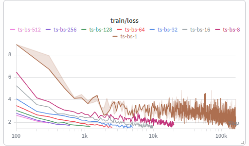
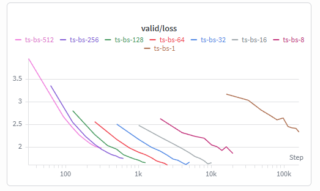
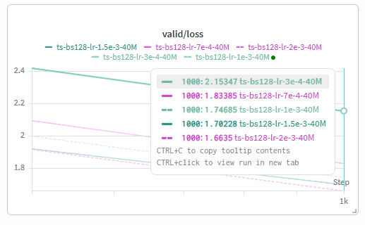
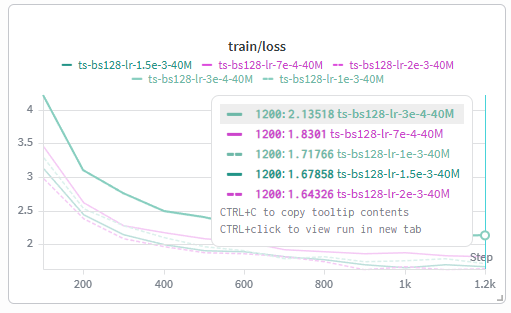
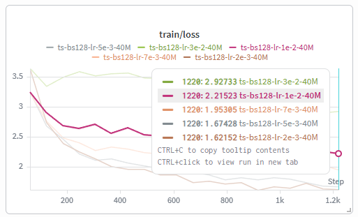
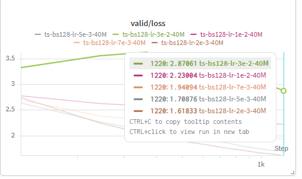

## Problem (batch_size_experiment): Batch size variations (1 B200 hr) (1 point)

### Prompt

Vary your batch size all the way from `1` to the GPU memory limit. Try at least a few batch sizes in between, including typical sizes like `64` and `128`.

> Deliverable: Learning curves for runs with different batch sizes. The learning rates should be optimized again if necessary.

> Deliverable: A few sentences discussing your findings on batch sizes and their impacts on training.

### Answer

我将 batch size 从 1 一直增大到接近显存上限，并测试了中间的一些典型值，包括 8、16、32、64、128、256 和 512。在我的设置下，最大可用 batch size 约为 624，因此 512 已经接近实际可用的最大 batch size。

当 batch_size = 1 时，训练曲线非常 noisy，train loss 抖动很明显，而且吞吐只有几千 tokens/s。虽然 validation loss 最后也在下降，但 wall-clock 效率很差，需要很多 optimizer updates 才能处理同样数量的 token。batch_size = 8 相比 1 稳定很多，但吞吐仍然明显低于更大的 batch size。

batch_size = 16 到 128 是比较好的区间。这个范围内 train loss 明显更平滑，validation loss 下降也比较稳定，同时吞吐提升到大约 6.5e4 到 8e4 tokens/s。尤其是 batch_size = 128，吞吐最高，validation 曲线也比较顺，因此它在训练效率和优化稳定性之间取得了最好的平衡。

继续增大到 256 或 512 后，吞吐没有继续明显提高，甚至 512 低于 128/256。同时，如果总 token budget 固定，更大的 batch size 意味着 optimizer update 次数更少。虽然每次更新的梯度估计方差更小，但更新次数减少可能会抵消这个优势，所以最大 batch size 并不一定带来更好的 final validation loss。

因此，我后续选择 batch_size = 128。它不是单纯因为 final loss 最低，而是因为它综合来看有最高或接近最高的吞吐、较平滑的训练曲线，以及较好的 validation loss 下降速度。非常小的 batch size 主要问题是噪声大和效率低；非常大的 batch size 则出现吞吐收益递减，并且在固定 token budget 下减少了参数更新次数。

由于 batch size 改成 128 之后，最优 learning rate 可能也会改变，我又在固定 `batch_size = 128`、总训练 token 数为 40M 的设置下重新做了一轮 learning rate sweep。

第一轮我测试了 `3e-4`、`7e-4`、`1e-3`、`1.5e-3` 和 `2e-3`。从 train loss 和 validation loss 来看，学习率从 `3e-4` 增大到 `2e-3` 时，收敛速度持续变快，最终 validation loss 也持续降低。其中 `2e-3` 在这组实验中表现最好，40M token 短训结束时的 validation loss 最低。

随后我继续测试比 `2e-3` 更大的 learning rate，以检查 `2e-3` 是否已经接近不稳定边界。结果显示，继续增大学习率后效果开始变差：`5e-3` 虽然仍然可以训练，但 validation loss 已经高于 `2e-3`；`7e-3`、`1e-2` 和 `3e-2` 的训练效果进一步恶化，其中较大的 learning rate 出现明显不稳定或不能有效收敛。

因此，在 `batch_size = 128` 的设置下，我选择 `max_lr = 2e-3` 作为后续实验的学习率。这个结果也说明，在重新选择 batch size 之后重新调 learning rate 是必要的：相比之前的 `1.5e-3`，`2e-3` 在新的 batch size 下取得了更好的短训 validation loss。
