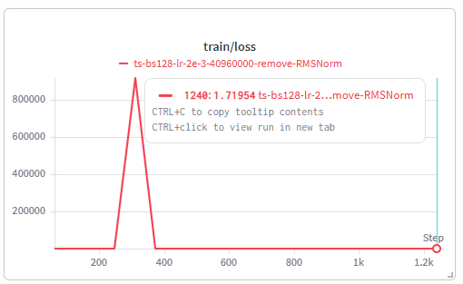
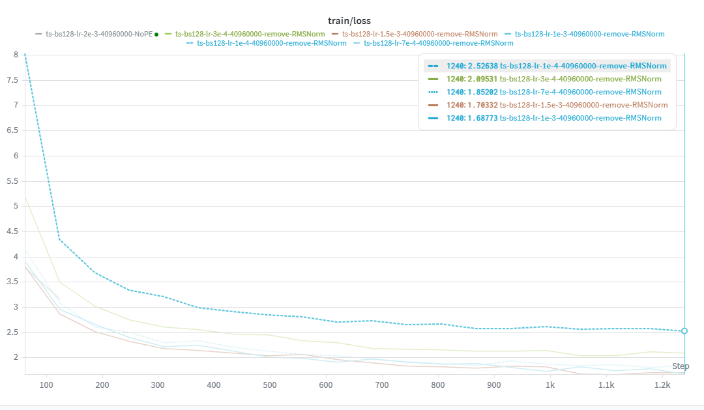
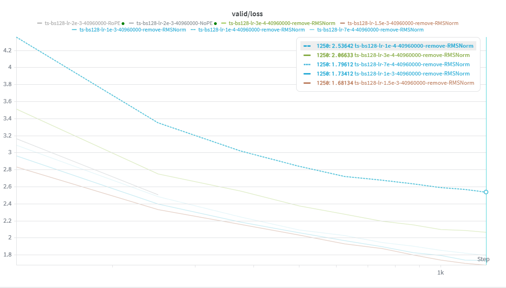

## Problem (layer_norm_ablation): Remove RMSNorm and train (0.5 B200 hrs) (1 point)

### Prompt

Remove all of the RMSNorms from your Transformer and train. What happens at the previous optimal learning rate? Can you get stability by using a lower learning rate?

> Deliverable: A learning curve for when you remove RMSNorms and train, as well as a learning curve for the best learning rate.

> Deliverable: A few sentences of commentary on the impact of RMSNorm.

### Answer

移除所有 RMSNorm 后，模型在之前调好的 learning rate `2e-3` 下明显更不稳定，train loss 出现了非常大的 transient spike，说明没有 normalization 时 activation 或 logits 的尺度容易失控。不过该 run 没有直接变成 NaN，后续 loss 仍然可以下降。

当降低 learning rate 后，训练曲线更加稳定，spike 消失。在本次 sweep 中，`1.5e-3` 取得了最低的 validation loss，因此我将其作为移除 RMSNorm 后的最佳 learning rate。

