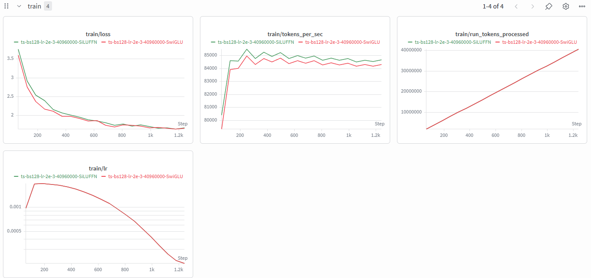
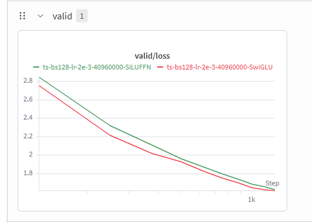

## Problem (swiglu_ablation): SwiGLU vs. SiLU (0.5 B200 hrs) (1 point)

### Prompt

> Deliverable: A learning curve comparing the performance of SwiGLU and SiLU feed-forward networks, with approximately matched parameter counts.

> Deliverable: A few sentences discussing your findings.

### Answer

在本次实验中，我比较了默认的 SwiGLU FFN 和参数量大致匹配的 SiLU FFN。SiLU FFN 使用两层线性层，并将 hidden dimension 设置为 `4 * d_model`；SwiGLU 使用三层线性层，hidden dimension 约为 `8/3 * d_model`，因此两者参数量大致相近。

从 learning curves 来看，两种 FFN 的训练曲线非常接近，都能稳定收敛。最终 validation loss 中，SwiGLU 约为 1.616，SiLU FFN 约为 1.629，SwiGLU 略低一些。这说明 gated FFN 在本实验设置下带来了一点性能收益，但差异不大。

一个可能原因是本实验使用的是较小模型和 TinyStories 的短训设置，任务相对简单，因此 FFN 结构差异没有被明显放大。更长训练、更大模型或更复杂数据集上，SwiGLU 的优势可能会更加明显。
