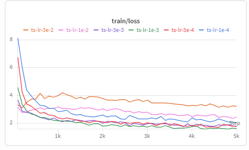
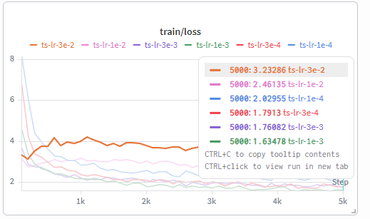
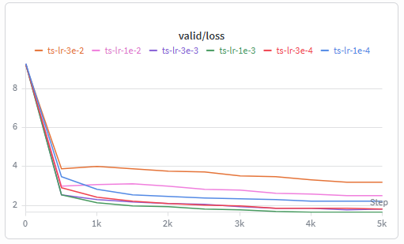
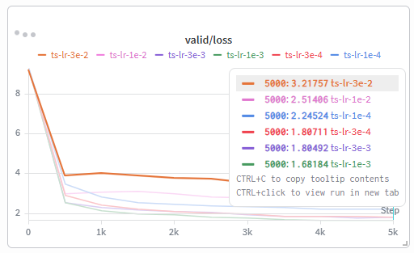
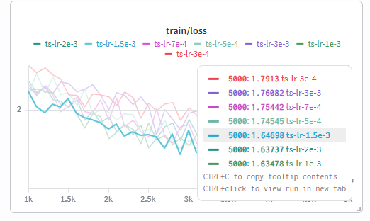
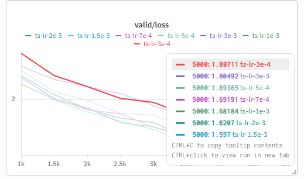
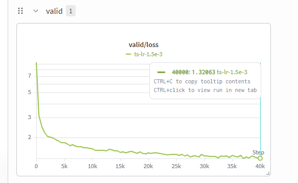
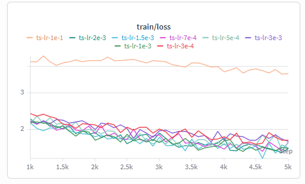
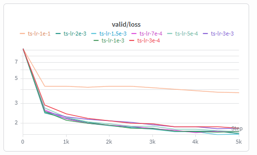

## Problem (learning_rate): Tune the learning rate (2 B200 hrs) (3 points)

### Prompt

The learning rate is one of the most important hyperparameters to tune. Taking the base model you’ve trained, answer the following questions.

(a) Perform a hyperparameter sweep over the learning rates and report the final losses, or note divergence if the optimizer diverges.

> Deliverable: Learning curves associated with multiple learning rates. Explain your hyperparameter search strategy.

> Deliverable: A model with validation loss, per token, on TinyStories of at most `1.45`.

> **Low-Resource Tip: Train for a few steps on CPU or Apple Silicon**
>
> If you are running on `cpu` or `mps`, you should instead reduce the total tokens processed count to `40,000,000`, which will be sufficient to produce reasonably fluent text. You may also increase the target validation loss from `1.45` to `2.00`.
>
> Running our solution code with a tuned learning rate on an M4 Max chip and `36 GB` of RAM, we use `batch size × total step count × context length = 32 × 5000 × 256 = 40,960,000` tokens, which takes `1 hour and 22 minutes` on `cpu` and `36 minutes` on `mps`. At step `5000`, we achieve a validation loss of `1.80`.

**Some Additional Tips**

- When using `N` training steps, we suggest adjusting the cosine learning rate decay schedule to terminate its decay, that is, reach the minimum learning rate, at precisely step `N`.
- When using `mps`, do not use TF32 kernels. In particular, do not set:

```python
torch.set_float32_matmul_precision("high")
```

as you might with CUDA devices. We tried enabling TF32 kernels with `mps`, using `torch` version `2.9.0`, and found the backend sometimes uses silently broken kernels that cause unstable training.

- You can speed up training by JIT-compiling your model with `torch.compile`.

Specifically:

```python
# On cpu
model = torch.compile(model)

# On mps
model = torch.compile(model, backend="aot_eager")
```

Compilation with Inductor is not supported on `mps` as of `torch` version `2.9.0`.

(b) Folk wisdom is that the best learning rate is “at the edge of stability.” Investigate how the point at which learning rates diverge is related to your best learning rate.

> Deliverable: Learning curves of increasing learning rate which include at least one divergent run and an analysis of how this relates to convergence rates.

### Answer

a. 我首先对学习率做了一个粗粒度的 log-scale sweep，范围从 1e-4 到 3e-2，每个设置训练 5000 steps。这样做的目的是先找到明显过小、合适、以及过大的学习率区间






粗扫之后可以看到，1e-4 收敛太慢，1e-2 和 3e-2 的训练效果明显变差，模型不能有效收敛；表现最好的区间大约在 1e-3 附近。

接着我在 3e-4 到 3e-3 之间做了更细的搜索，包括 7e-4、1e-3、1.5e-3 和 2e-3。




从 validation loss 来看，1.5e-3 在 5000 steps 时表现最好，略优于 1e-3 和 2e-3，因此我选择 1.5e-3 作为最终长时间训练的学习率。



使用 lr = 1.5e-3 训练 40000 steps 后，模型在 TinyStories 上的 validation loss 达到约 1.32 per token，低于 handout 要求的 1.45，说明这个学习率设置能够达到目标性能。


b. 



关于 “edge of stability”，实验结果基本符合这个经验规律：当学习率从 1e-4 增大到 1e-3 / 1.5e-3 时，收敛速度明显变快，最终 validation loss 也更低。但继续增大学习率后，优化开始变差：3e-3 仍然可以训练，但效果已经弱于最佳学习率；而 1e-2、3e-2 或更大的学习率不能有效收敛，loss 保持较高或出现明显震荡。因此，最佳学习率并不是越大越好，而是出现在不稳定边界之前、但已经比较接近该边界的位置。
